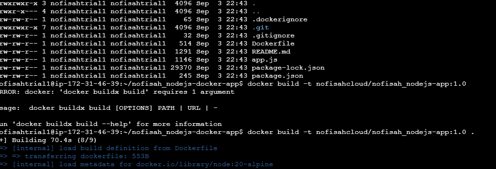
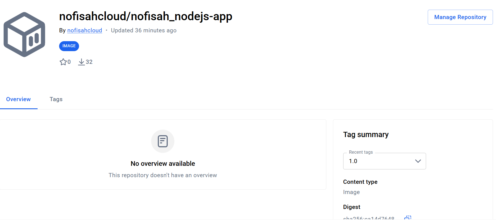
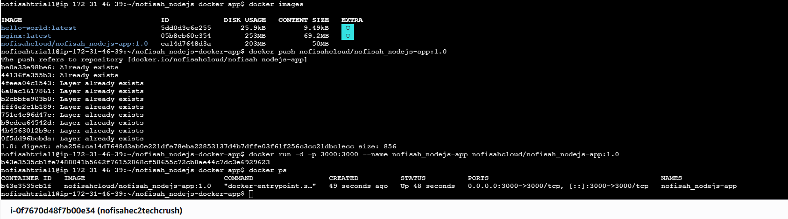
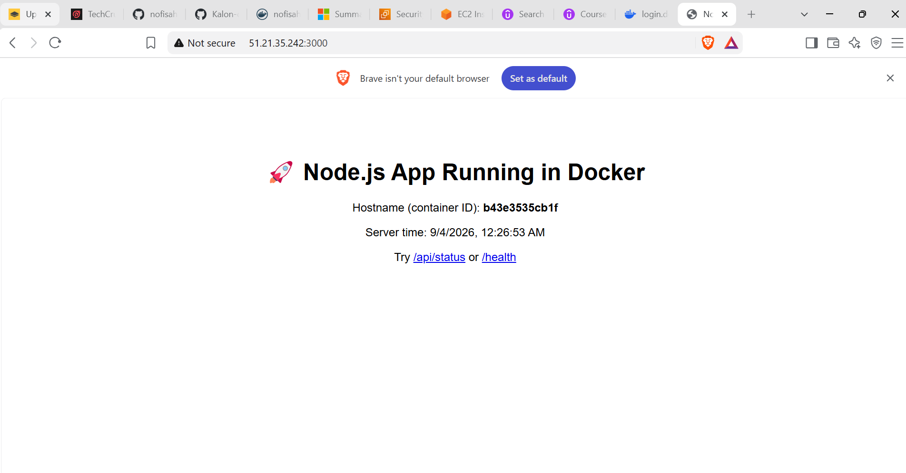

# Node.js & Docker Deployment Assignment

A simple Node.js (Express) application, containerized with Docker and deployed via Docker Hub.

## What the app does

- `GET /` — HTML landing page showing the container hostname and server time
- `GET /health` — health check endpoint, returns `{ status: "ok" }`
- `GET /api/status` — JSON status endpoint

## Tech stack

- Node.js 20 + Express
- Docker (multi-stage-friendly `node:20-alpine` base image)
- Docker Hub for image registry

## Run locally (without Docker)

```bash
npm install
npm start
# visit http://localhost:3000
```

## Run with Docker

```bash
# Build
docker build -t YOUR_DOCKERHUB_USERNAME/nodejs-app:1.0 .

# Run
docker run -d -p 3000:3000 YOUR_DOCKERHUB_USERNAME/nodejs-app:1.0

# visit http://YOUR_SERVER_IP:3000
```

## Pull from Docker Hub

```bash
docker pull YOUR_DOCKERHUB_USERNAME/nodejs-app:1.0
docker run -d -p 3000:3000 YOUR_DOCKERHUB_USERNAME/nodejs-app:1.0
```

---

## Screenshots

### 1. Docker Build Command


### 2. Docker Hub Image


### 3. Running Docker Container (`docker ps`)


### 4. Live Application

# nofisah_nodejs-docker-app
